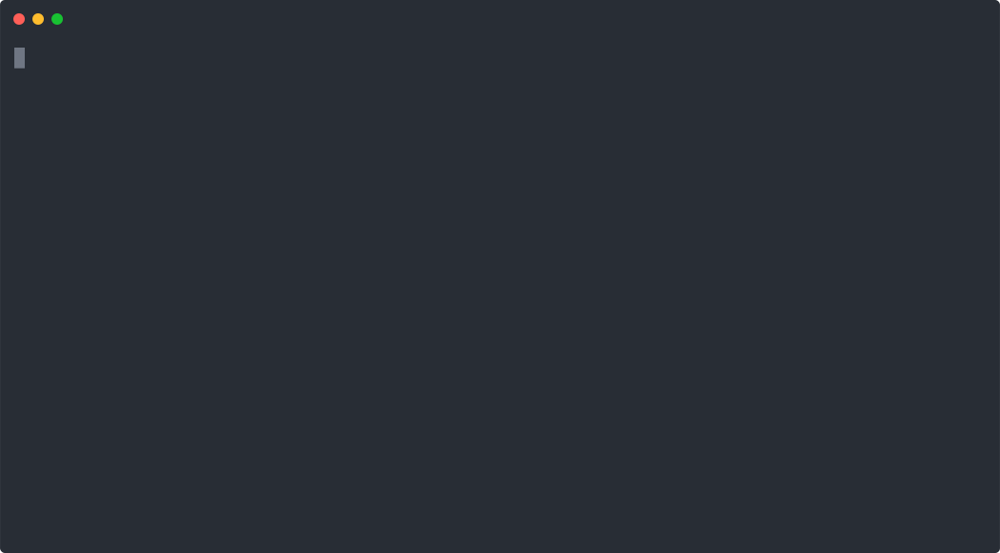

# Brain-games

### Hexlet tests and linter status:
[](https://github.com/DeXXteR73/frontend-project-lvl1/actions)
[](https://codeclimate.com/github/DeXXteR73/frontend-project-lvl1/maintainability)

## Brain-games is a series of 5 console mini-games that can entertain you and be a warm-up for your brain

### Requirements

- Mac / Linux
- Node.js version 18 or later

### Install

```
$ git clone git@github.com:DeXXteR73/frontend-project-lvl1.git
$ cd frontend-project-lvl1
$ npm link
```

### Demo brain-even:

</img>

### Demo brain-calc:

</img>

### Demo brain-gcd:

</img>

### Demo brain-progression:

</img>

### Demo brain-prime:

</img>